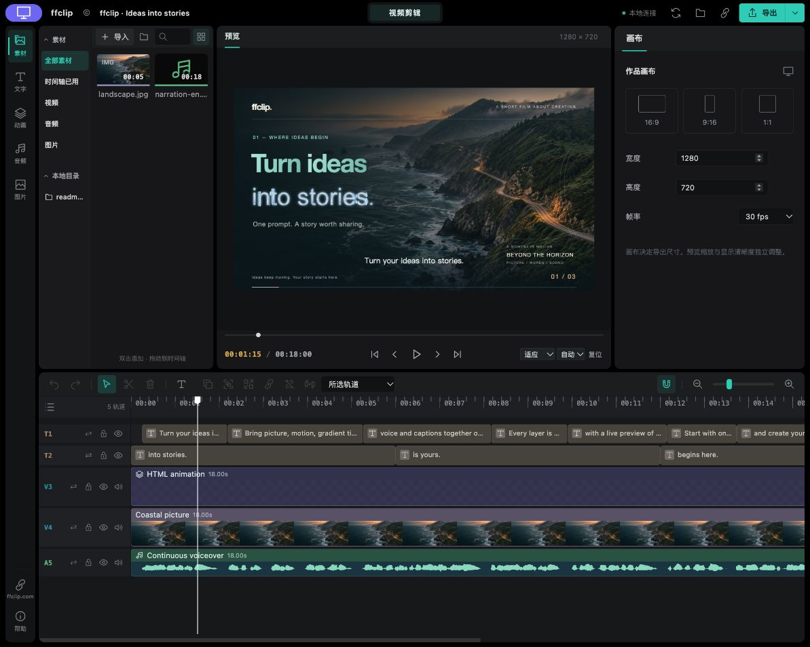

# VideoCut

[英文](README.md) · [官网](https://ffclip.com)

让 AI 助手帮你剪视频，实时预览，加字幕、动画并导出。



- 在可编辑时间轴上裁剪、排列视频。
- 添加字幕、动态标题和本地配音。
- 实时预览修改，导出 MP4 或 WebM。

## 复制给 AI 助手，安装后直接体验

```text
帮我安装 https://github.com/425776024/ffclip-plugins 的 VideoCut，接入当前助手，保留已有配置，并在浏览器打开内置可编辑示例。需要 Node.js 22 或更新版本。如果新工具需要重启才能连接，先用命令行打开示例让我体验。
```

## 或复制这一行到终端

```sh
npm install -g @ffclip-com/videocut@latest && videocut-web --demo --open --port 0
```

需要 Node.js 22+ 和 Chrome 或 Edge。内置作品无需选素材、无需下载模型。打开后可直接播放，也可以对助手说：“把标题改成我的旅行，然后导出视频。”

[使用说明](docs/usage-zh.md) · [MIT 许可证](LICENSE) · [第三方声明](THIRD_PARTY_NOTICES.md)
