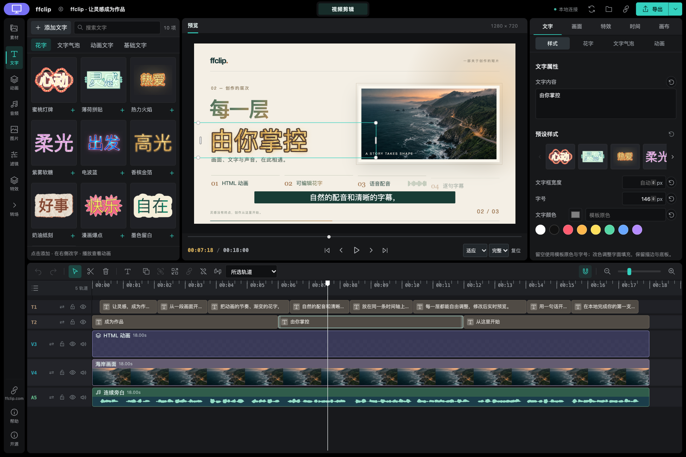
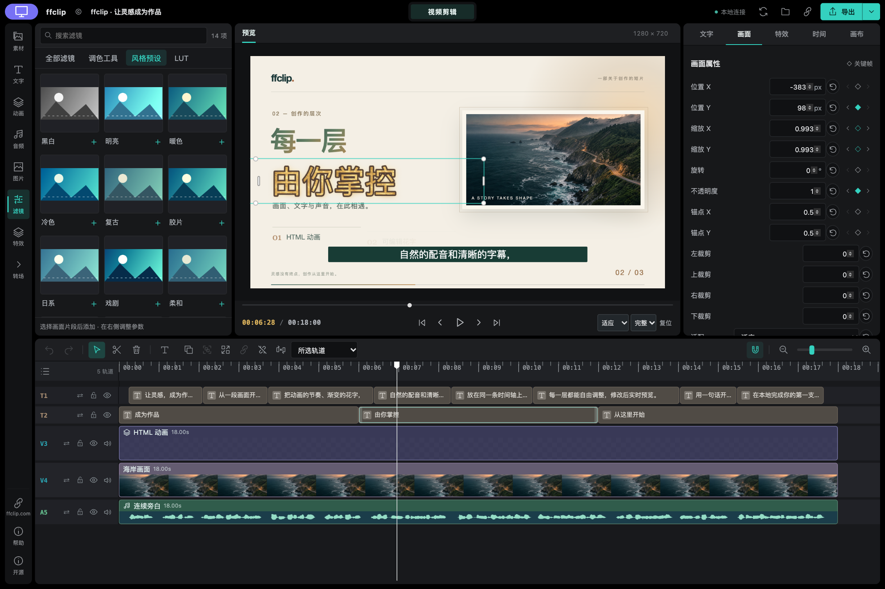
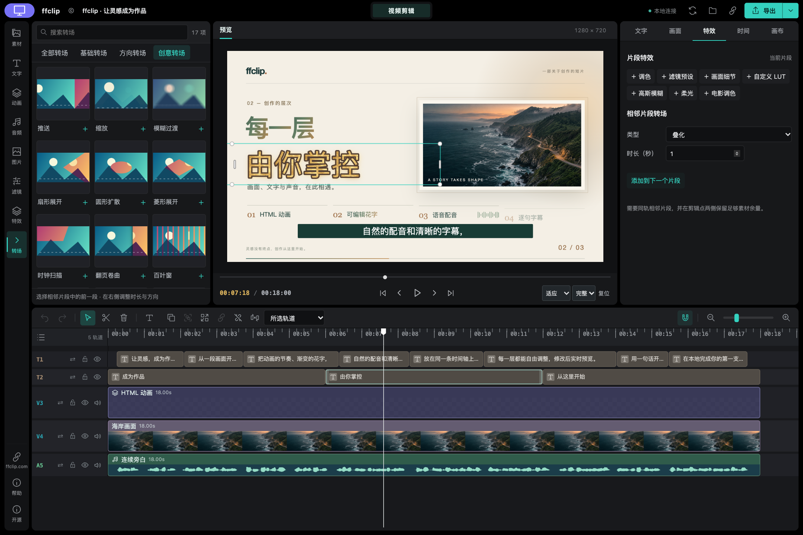

# VideoCut

## 复制给 AI 助手，安装后直接体验

```text
请从 npm 安装最新版 @ffclip-com/videocut，接入当前助手，保留已有配置，并在浏览器打开内置可编辑示例。需要 Node.js 22 或更新版本。如果新工具需要重启才能连接，先用命令行打开示例让我体验。
```

## 或复制这一行到终端

```sh
npm install -g @ffclip-com/videocut@latest && videocut-web --demo --open --port 0
```

[英文](README.md) · [官网](https://ffclip.com)



<details>
<summary>查看滤镜、关键帧按钮与转场面板</summary>





</details>

让 AI 助手帮你剪视频，实时预览，加字幕、动画并导出。

- 在可编辑时间轴上裁剪、排列视频。
- 添加字幕、动态标题和本地配音。
- 应用滤镜、转场，通过属性面板和关键帧按钮调整效果。
- 实时预览修改，导出 MP4 或 WebM。

需要 Node.js 22+ 和 Chrome 或 Edge。内置作品无需选素材、无需下载模型。打开后可直接播放，也可以对助手说：“把标题改成我的旅行，然后导出视频。”

[使用说明](docs/usage-zh.md) · [MIT 许可证](LICENSE) · [第三方声明](THIRD_PARTY_NOTICES.md)

本项目早期浏览器音视频实现引用并改编了 [WebAV](https://github.com/WebAV-Tech/WebAV) 开源项目（MIT，Copyright © 2023 风痕），感谢作者及社区贡献者。详见 [开源声明与许可证](THIRD_PARTY_NOTICES.md)。
