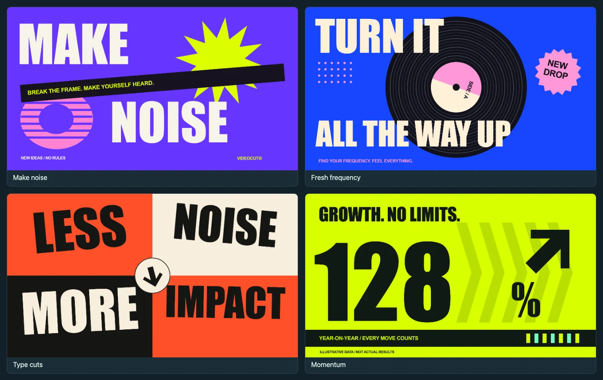

[中文](README-zh.md) · [Website](https://ffclip.com) · [Usage guide](docs/usage-en.md) · [WeChat article (中文)](https://mp.weixin.qq.com/s/MKfMipfXc2xv_B3-mVYq6w)

## Quick Start

<sub>Copy this into your AI assistant</sub>

```text
Install the latest @ffclip-com/videocut from npm and connect it to this assistant.
Preserve my existing settings and open the built-in editable demo. Use Node.js 22+.
If the tool connection needs a restart, open the demo with the CLI first.
```

**Describe the video. Let your assistant make the first cut. Refine it on the timeline.**

<details open>
<summary>Watch the demo: from a conversation to an editable video</summary>

https://github.com/user-attachments/assets/7bf4cec6-9cab-4b9d-bd9e-bc0d8e44d9be

</details>

Trim clips, add local voiceover and captions, preview live, and export MP4 or WebM. Save the complete project to keep editing later.

## Motion you can make your own

**10 native PAGX templates** including kinetic type, record drops and bold data. Eight full-frame designs and two transparent overlays, in Chinese and English. Click a clip to edit its text, colors and shapes; animation playback and export use native rendering without per-frame browser screenshots.

[](docs/videos/pagx-motion.mp4)

[Play the actual animations · Chinese / English](docs/videos/pagx-motion.mp4)

```text
Use VideoCut’s “Make noise” PAGX template for an 8-second intro.
Set the two title lines to “MAKE” and “WAVES”. Use blue accents.
Keep it editable, open the preview and export an MP4.
```

[More examples & editable projects](docs/examples/readme/README.md) · [MIT](LICENSE) · [Third-party notices](THIRD_PARTY_NOTICES.md), including [WebAV](https://github.com/WebAV-Tech/WebAV).

## Give your story a voice

An actual VideoCut export with local Chinese narration and editable captions. Play and unmute to listen. Generating new voiceovers requires a model download.

```text
Turn my script into a narrated video with matching captions.
Keep narration and captions on separate editable tracks, open the preview
and export an MP4 with sound.
```

https://github.com/user-attachments/assets/0da34d26-bc46-474d-856a-34a61aef828e
