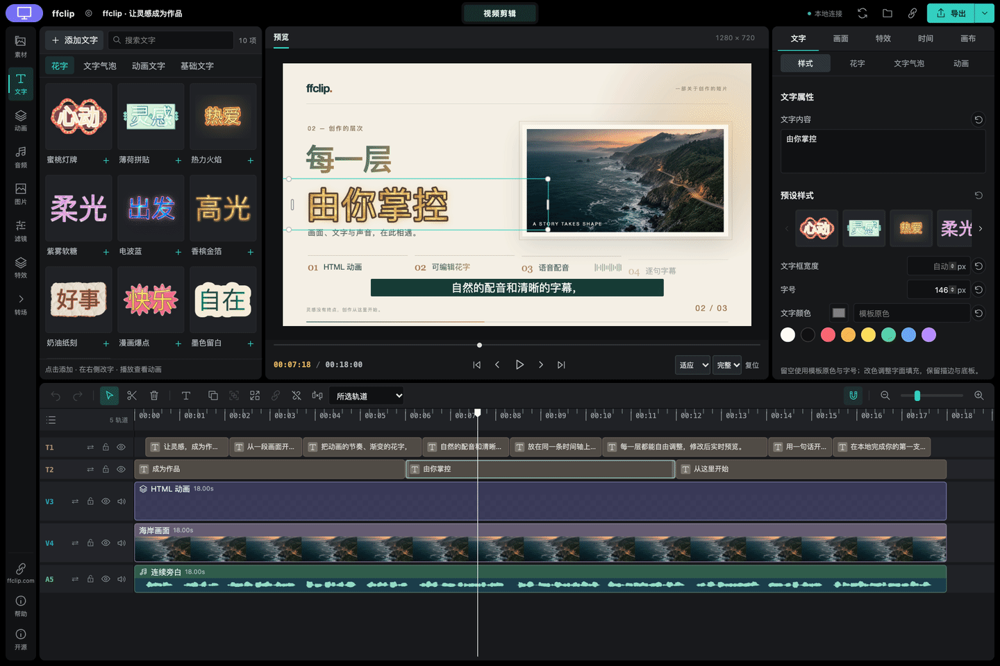

# VideoCut

Edit videos, create HTML motion graphics and generate local voiceovers with your AI assistant. Keep every change on an editable timeline.

## Copy this into your AI assistant

```text
Install the latest official npm package @ffclip-com/videocut. Set it up for this assistant, preserve my existing settings, and open the built-in editable demo in my browser. Use Node.js 22 or newer. If a new tool connection needs a restart, open the demo with the CLI first.
```

## Or run this in your terminal

```sh
npm install -g @ffclip-com/videocut@latest && videocut-web --demo --open --port 0
```

[Chinese](README-zh.md) · [Website](https://ffclip.com)

Requires Node.js 22+ and Chrome or Edge. The bundled demo needs no media selection or model downloads. Ask your assistant to trim a clip, add a title, or export a video.

## Start with a prompt. Make it yours.

These videos were exported by VideoCut and play directly below. After setup, send a prompt to your assistant and customize the words, colors or data for your own version.

### HTML motion · Product intro

```text
Use VideoCut to create a 6-second, 16:9 HTML product intro. Use a cream background and coral accents. Reveal “From idea.” then “To video.” with upward motion. Fan out three overlapping cards on the right, let them float gently, and rotate a circular badge. Keep the titles and animation editable, open the preview, and export an MP4.
```

https://github.com/user-attachments/assets/60a8880e-c636-435c-9dcd-6c2b287854ac

[HTML source](docs/examples/readme/html-intro.html)

Keep going: `Change the title to “Weekend stories” and the coral accents to blue. Keep the card animation.`

### Animated data · Numbers with a story

```text
Use VideoCut to create a 6-second HTML data animation. Use a dark green background, light green bars, and the title “Small steps. Big momentum.” Grow the Q1–Q4 bars in sequence and count up from zero to 24%, 48%, 72% and 96%. End the large number on the left at 96%. Label this as illustrative data and keep the values editable. Open the preview and export an MP4.
```

https://github.com/user-attachments/assets/7e8fb040-f794-4732-9f98-5d83c013ec94

[HTML source](docs/examples/readme/html-chart.html)

Keep going: `Change the values to 18, 42, 65 and 88, and the title to “A year of progress”.`

### Local voiceover · From script to spoken story

```text
Use VideoCut’s local Chinese female voice zf_001 at normal speed to read: “给灵感一个声音。把文字变成配音，让字幕跟随节奏。现在，开始你的创作。” Make an approximately 10-second video in cream and olive green, with the title “让灵感，成为作品。” and a circular waveform driven by the actual audio. Generate captions, then correct their wording and sentence boundaries against the script. Keep speech and captions on separate editable tracks. Open the preview and export an MP4 with sound.
```

https://github.com/user-attachments/assets/0da34d26-bc46-474d-856a-34a61aef828e

Play the video and unmute it to hear the locally generated Chinese narration.

Keep going: `Replace the narration with an English product introduction using af_maple. Regenerate speech and captions, keeping the visual style.`

Voiceover and speech recognition download their models on first use, then process locally. The sample uses Chinese narration; its captions were corrected against the script.

[Download all three editable projects](docs/examples/readme/showcase-projects.zip) · [Opening the examples](docs/examples/readme/README.md)

<details>
<summary>See the editor: text, filters, keyframes and transitions</summary>



Trim and arrange clips, adjust captions, effects and keyframes, preview live, and export MP4 or WebM.

The About dialog includes the official website, WeChat QR codes and the creator’s Bilibili profile. The editor automatically checks for new releases; choosing Update saves the complete project before installing the latest official package. Restart the ffclip service or MCP connection to use the installed version.

</details>

[Usage guide](docs/usage-en.md) · [MIT](LICENSE) · [Third-party notices](THIRD_PARTY_NOTICES.md)

VideoCut’s early browser video implementation incorporated and adapted [WebAV](https://github.com/WebAV-Tech/WebAV) (MIT, Copyright © 2023 风痕). Thanks to its author and contributors. See [third-party acknowledgment](THIRD_PARTY_NOTICES.md).
